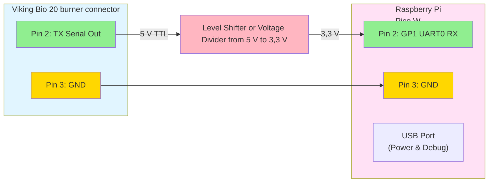

# Viking Bio Matter Bridge

A Matter bridge for the [Viking Bio 20](https://varmebaronen.se/produkter/single/p-15/viking-bio-pelletsbrannare) burner, built for [Raspberry Pi Pico W](https://www.raspberrypi.com/products/raspberry-pi-pico/). This firmware reads TTL serial data from the burner and exposes flame status and fan speed through the Matter protocol.

## Features

- **Dual-Core Architecture**: Utilizes both RP2040 cores for optimal performance
  - Core 0: Serial input, LED control, watchdog management
  - Core 1: Matter protocol, network processing, attribute reporting
- **Serial Communication**: Reads TTL serial data at 9600&nbsp;baud from Viking Bio 20 burner
- **Flame Detection**: Reports real-time flame status
- **Fan Speed Monitoring**: Reports current fan speed (0-100&nbsp;%)
- **Temperature Monitoring**: Reports burner temperature
- **Matter Bridge**: Exposes burner data through Matter protocol over WiFi
- **WiFi Connectivity**: Connects to your local network for Matter communication
- **DNS-SD Discovery**: Automatic device discovery via mDNS (_matterc._udp)
- **BLE Commissioning**: Bluetooth LE for easy WiFi credential provisioning

## Security Status

✅ **All Critical Security Issues Resolved** (as of February 15, 2026)

This firmware has undergone comprehensive security review and all critical vulnerabilities have been addressed. For security considerations and best practices, see [SECURITY_NOTES.md](SECURITY_NOTES.md).

## Hardware Requirements

- **Raspberry Pi Pico W** (WiFi required for Matter)
- Viking Bio 20 burner with TTL serial output
- USB cable for power and debugging

## Wiring

Connect the Viking Bio 20 TTL serial output to the Raspberry Pi Pico W by RJ12 cable:


**Note**: The Pico W RX pin (GP1) expects 3,3&nbsp;V logic levels. The Viking Bio 20's TTL output voltage should be verified before connecting directly. If it outputs 5&nbsp;V TTL (which is common), a level shifter (e.g., bi-directional logic level converter) or voltage divider (two resistors: 2kΩ from TX to RX, 1kΩ from RX to GND) is required for safe voltage conversion. The diagram above shows the configuration with level shifting, which is the recommended safe approach.

## Serial Protocol

The firmware supports two serial data formats:

### Binary Protocol (Recommended)
```
[0xAA] [FLAGS] [FAN_SPEED] [TEMP_HIGH] [TEMP_LOW] [0x55]
```
- `FLAGS`: bit 0 = flame detected, bits 1-7 = error codes
- `FAN_SPEED`: 0-100 (percentage)
- `TEMP_HIGH, TEMP_LOW`: Temperature in Celsius (16-bit big-endian)

### Text Protocol (Fallback)
```
F:1,S:50,T:75\n
```
- `F`: Flame status (0=off, 1=on)
- `S`: Fan speed (0-100&nbsp;%)
- `T`: Temperature (°C)

## Building Firmware

### Prerequisites

1. Install the Pico SDK (v2.2.0 or later):
   ```bash
   git clone --branch 2.2.0 https://github.com/raspberrypi/pico-sdk.git
   cd pico-sdk
   git submodule update --init
   export PICO_SDK_PATH=$(pwd)
   ```

2. Install ARM toolchain:
   ```bash
   # Ubuntu/Debian
   sudo apt-get install cmake gcc-arm-none-eabi libnewlib-arm-none-eabi build-essential
   
   # macOS
   brew install cmake arm-none-eabi-gcc
   ```

**Note**: This project requires Pico SDK 2.2.0 or later for full compatibility with mbedTLS 3.6.2 and latest platform features.

### Development Container (Recommended)

For the easiest development experience, use the included VS Code devcontainer that sets up all dependencies automatically:

1. **Prerequisites:**
   - [Visual Studio Code](https://code.visualstudio.com/)
   - [Docker Desktop](https://www.docker.com/products/docker-desktop) or compatible container runtime
   - [Dev Containers extension](https://marketplace.visualstudio.com/items?itemName=ms-vscode-remote.remote-containers) for VS Code

2. **Open in Container:**
   - Clone this repository
   - Open the repository folder in VS Code
   - When prompted, click "Reopen in Container" (or use Command Palette → "Dev Containers: Reopen in Container")
   - Wait for the container to build and initialize (first time takes 5-10 minutes)

3. **Build with CMake Presets:**
   ```bash
   # Configure and build using the preset
   cmake --preset pico-default
   cmake --build build
   ```

The devcontainer automatically:
- Installs ARM toolchain (gcc-arm-none-eabi) and build tools (CMake, Ninja)
- Downloads and initializes Pico SDK 2.2.0 with all submodules
- Installs debugging tools (gdb-multiarch, openocd)
- Installs Python tools (pyserial, pre-commit)
- Mounts USB devices for hardware debugging (/dev/bus/usb)
- Configures VS Code with recommended extensions for embedded development

**USB Device Access:** On Linux hosts, you may need to add udev rules or run Docker with `--privileged` to access USB devices. On Windows/macOS, Docker Desktop handles USB passthrough automatically for most devices.

### Build Steps (Manual Setup)

1. **Build the firmware:**
   ```bash
   mkdir build
   cd build
   cmake ..
   make
   ```

The build process generates firmware files with version information:
- `viking_bio_matter-{version}.uf2` - Main firmware file for flashing (versioned)
- `viking_bio_matter-{version}.elf` - ELF binary (versioned)
- `viking_bio_matter-{version}.bin` - Raw binary (versioned)
- `viking_bio_matter-{version}.hex` - Intel HEX format (versioned)

**Version Format**: The version is automatically extracted from git (e.g., `78422fa` for commit hash, or `v1.0.0` for tags).

This generates Matter-enabled firmware that:
- **Automatically checks for stored WiFi credentials on boot**
- **Starts BLE commissioning mode if no credentials are found**
- **Connects to WiFi using stored credentials if available**
- Initializes the Matter stack
- Prints commissioning QR code and PIN
- Exposes Viking Bio data as Matter attributes
- Can be commissioned by Matter controllers (e.g., chip-tool)

See [platform/pico_w_chip_port/README.md](platform/pico_w_chip_port/README.md) for detailed Matter configuration and commissioning instructions.

### WiFi Commissioning via Bluetooth LE

The device uses **Bluetooth LE (BLE)** for WiFi commissioning, following the Matter standard:

**Commissioning Flow:**
1. On first boot (no WiFi credentials), the device starts BLE advertising
2. Use a Matter-compatible controller or app to:
   - Discover the device via BLE
   - Provision WiFi credentials securely over BLE
   - Complete Matter commissioning
3. Device automatically connects to WiFi and stops BLE advertising
4. BLE commissioning also stops when WiFi is connected AND device is commissioned

**Using chip-tool for BLE Commissioning:**
```bash
# Commission device over BLE (replace PIN with value from serial output)
chip-tool pairing ble-wifi <node-id> <ssid> <password> <discriminator> <pin>

# Example:
chip-tool pairing ble-wifi 1 MyHomeWiFi MyPassword123 3912 24890840
```

**Using Matter Controller Apps:**
- Google Home, Apple Home, Amazon Alexa, and other Matter controllers support BLE commissioning
- Simply scan the QR code displayed on the device serial output
- Or manually enter the setup code

**Pre-configured WiFi (Optional):**
Credentials can be stored in flash during initial setup. The device will automatically connect on boot without BLE commissioning.

### Flashing the Firmware

1. Hold the BOOTSEL button on the Pico W while connecting it via USB
2. The Pico W will appear as a mass storage device
3. Copy `build/viking_bio_matter.uf2` to the Pico W
4. The Pico W will automatically reboot with the new firmware

## GitHub Actions

The firmware is automatically built on push to `main` or `develop` branches. Build artifacts are available in the Actions tab.

## Usage

1. Flash the firmware to your Raspberry Pi Pico W
2. Connect the Viking Bio 20 serial output to the Pico W (see Wiring section)
3. Power the Pico W via USB
4. Connect to the Pico's USB serial to view commissioning info:
   ```bash
   screen /dev/ttyACM0 115200
   # Or use Thonny IDE (Tools > Serial)
   ```
   
   You'll see:
   ```
   ====================================
       Matter Commissioning Info
   ====================================
   Device MAC:     28:CD:C1:00:00:01
   Setup PIN Code: 24890840
   Discriminator:  3912 (0xF48)
   
   ⚠️  IMPORTANT:
      PIN is derived from device MAC.
      Use tools/derive_pin.py to compute
      the PIN from the MAC address above.
   
   ⚠️  NOTE: Discriminator was randomly
      generated on first boot and saved
      to flash. Value is in testing range.
   ====================================
   ```
   
   **Note**: The Setup PIN is unique per device, derived from its MAC address.
   You can compute it offline using:
   ```bash
   python3 tools/derive_pin.py 28:CD:C1:00:00:01
   ```

5. **Commission the device using Matter controller:**
   
   **Via BLE (Recommended):**
   ```bash
   # Commission device over Bluetooth LE with WiFi credentials
   # Replace values with your network and PIN from serial output
   chip-tool pairing ble-wifi 1 MyHomeWiFi MyPassword123 3912 24890840
   
   # Or scan the QR code with a Matter-compatible app:
   # - Google Home
   # - Apple Home
   # - Amazon Alexa
   # - Samsung SmartThings
   ```
   
   **With Pre-stored Credentials:**
   ```bash
   # If credentials are already stored, pair directly over WiFi
   chip-tool pairing onnetwork 1 24890840
   ```

6. Control and monitor attributes:
   ```bash
   # Read flame status (OnOff cluster)
   chip-tool onoff read on-off 1 1
   
   # Read fan speed (LevelControl cluster)
   chip-tool levelcontrol read current-level 1 1
   
   # Read temperature (TemperatureMeasurement cluster)
   chip-tool temperaturemeasurement read measured-value 1 1
   ```

**Matter Clusters Exposed:**
- **OnOff (0x0006)**: Flame detected state
- **LevelControl (0x0008)**: Fan speed (0-100%)
- **TemperatureMeasurement (0x0402)**: Burner temperature
- **NetworkCommissioning (0x0031)**: WiFi network provisioning

⚠️ **Security Note:** 
- The Setup PIN is **unique per device**, derived from the device MAC address using SHA-256 with product salt `VIKINGBIO-2026`.
- The discriminator is **randomly generated on first boot** and persisted to flash storage. Each device gets a unique value in the testing range (0xF00-0xFFF, 3840-4095).
- The PIN derivation algorithm is documented in `tools/derive_pin.py` and can be computed offline from a printed MAC address.

For detailed commissioning steps and troubleshooting, see:
- [docs/WIFI_COMMISSIONING_SUMMARY.md](docs/WIFI_COMMISSIONING_SUMMARY.md) - WiFi provisioning details
- [platform/pico_w_chip_port/README.md](platform/pico_w_chip_port/README.md) - Matter configuration

## Device Discovery

The Viking Bio Matter Bridge implements DNS-SD (mDNS) for automatic device discovery, allowing Matter controllers to find the device without manual IP configuration.

### Automatic Discovery

Once the device is connected to WiFi, it automatically advertises itself as:
- **Service Type**: `_matterc._udp.local`
- **Hostname**: `matter-<discriminator>` (e.g., `matter-0F84`)
- **Port**: 5540 (Matter commissioning port)

### Verify Device is Discoverable

**On macOS/Linux:**
```bash
# List all Matter commissionable devices
dns-sd -B _matterc._udp

# Get detailed information
dns-sd -L matter-<discriminator> _matterc._udp
```

**On Linux with Avahi:**
```bash
# Browse for all services
avahi-browse -a -r

# Browse for Matter devices
avahi-browse _matterc._udp -r
```

### TXT Records

The device advertises the following TXT records (per Matter specification):
- **D=**: Discriminator (12-bit value, e.g., `D=3972`)
- **VP=**: Vendor:Product ID (format: `VID,PID`, e.g., `VP=65521,32769`)
- **DT=**: Device Type (e.g., `DT=0x0302` for Temperature Sensor)
- **CM=**: Commissioning Mode (`CM=1` = accepting commissioning)

### Using chip-tool with Discovery

```bash
# Discover commissionable devices (finds device automatically)
chip-tool discover commissionables

# Commission using discovered device (no IP needed)
chip-tool pairing code 1 <SETUP_PIN_FROM_SERIAL>
```

For complete DNS-SD implementation details, see [docs/DNS_SD_IMPLEMENTATION.md](docs/DNS_SD_IMPLEMENTATION.md).

## Troubleshooting

### WiFi Commissioning Issues

**Problem: Device not connecting to WiFi**
- **Cause**: WiFi credentials not provisioned or incorrect
- **Solution**:
  1. Use BLE commissioning: `chip-tool pairing ble-wifi 1 <ssid> <password> <discriminator> <pin>`
  2. Verify credentials are correct (case-sensitive)
  3. Check WiFi signal strength
  4. Check serial output for error messages
  5. Verify WiFi network is 2.4GHz (Pico W doesn't support 5GHz)

**Problem: Cannot discover device via BLE**
- **Cause**: BLE not advertising or Bluetooth disabled
- **Solution**:
  1. Check serial output for "BLE: Starting advertising..." message
  2. Verify Bluetooth is enabled on your controller/phone
  3. BLE stops after successful WiFi connection - power cycle to restart
  4. Ensure discriminator matches (check serial output)
  5. Try moving closer to the device (BLE range is limited)

**Problem: Device doesn't connect after provisioning**
- **Cause**: Credentials saved but connection failed
- **Solution**:
  1. Check serial output for connection error codes
  2. Verify WiFi network is 2.4GHz (Pico W doesn't support 5GHz)
  3. Ensure WiFi uses WPA2-PSK authentication
  4. Power cycle device and check if it reconnects automatically

**Problem: Lost WiFi credentials, need to re-provision**
- **Solution**:
  1. Clear flash storage by re-flashing firmware
  2. Or: Power cycle - device will restart BLE advertising if credentials fail
  3. Serial command (if implemented): Send reset command via USB serial

### Checking Device Status

```bash
# Connect to serial monitor
screen /dev/ttyACM0 115200

# Look for these status messages:
# - "WiFi credentials found in flash" - Has stored credentials
# - "BLE: Starting advertising..." - In commissioning mode
# - "WiFi connected successfully" - Connected to network
# - "IP Address: x.x.x.x" - Device network address
```

### Matter Commissioning Debug

```bash
# Enable verbose logging in chip-tool
chip-tool --trace_decode 1 networkcommissioning add-or-update-wifi-network ...

# Check if device is discoverable
dns-sd -B _matterc._udp

# Verify device is commissioned
chip-tool pairing code 1 <setup-code>
```

## Development

### Project Structure

```
viking-bio-matter/
├── src/
│   ├── main.c                 # Main application entry point
│   ├── serial_handler.c       # UART/serial communication
│   ├── viking_bio_protocol.c  # Viking Bio protocol parser
│   └── matter_bridge.c        # Matter bridge implementation
├── include/
│   ├── serial_handler.h
│   ├── viking_bio_protocol.h
│   └── matter_bridge.h
├── platform/
│   └── pico_w_chip_port/      # Matter platform port for Pico W
│       ├── network_adapter.cpp    # WiFi/lwIP integration
│       ├── storage_adapter.cpp    # Flash storage for fabrics
│       ├── crypto_adapter.cpp     # mbedTLS crypto
│       ├── platform_manager.cpp   # Platform coordination
│       └── README.md              # Detailed Matter documentation
├── src/
│   ├── matter_minimal/          # Minimal Matter protocol implementation
│   │   ├── codec/               # TLV and message encoding
│   │   ├── transport/           # UDP transport layer
│   │   ├── security/            # PASE and session management
│   │   ├── interaction/         # Interaction model (read/subscribe)
│   │   └── clusters/            # Standard Matter clusters
│   ├── main.c                   # Entry point
│   ├── serial_handler.c         # UART RX handler
│   ├── matter_bridge.cpp        # Matter integration
│   └── viking_bio_protocol.c    # Protocol parser
├── examples/
│   └── viking_bio_simulator.py # Serial data simulator for testing
├── CMakeLists.txt             # Build configuration
└── .github/
    └── workflows/
        └── build-firmware.yml # CI/CD pipeline
```

### Storage Implementation with LittleFS

The firmware uses **LittleFS** for persistent storage, providing:

- **Wear Leveling**: Automatically distributes writes across flash memory to extend lifespan
- **Power-Loss Resilience**: Atomic operations recoverable from unexpected power loss
- **Efficient**: Dynamic block allocation with minimal overhead

**Configuration:**
- **Location**: Last 256KB of the 2MB flash
- **Filesystem**: LittleFS via [pico-lfs](https://github.com/tjko/pico-lfs)
- **Storage**: WiFi credentials, Matter fabric data, ACLs

**Testing:**
See `tests/storage/README.md` for test procedures including basic read/write, overwrite/delete, power cycle persistence, and wear leveling stress tests.

## Testing

### Serial Simulator

For testing without hardware, use the included simulator:

```bash
# Install dependencies
pip3 install pyserial

# Run simulator with binary protocol (default)
python3 examples/viking_bio_simulator.py /dev/ttyUSB0

# Run simulator with text protocol
python3 examples/viking_bio_simulator.py -p text /dev/ttyUSB0

# Change update interval
python3 examples/viking_bio_simulator.py -i 2.0 /dev/ttyUSB0
```

### Manual Testing

Send test data directly:

```bash
# Binary protocol (hex)
echo -ne '\xAA\x01\x50\x00\x4B\x55' > /dev/ttyUSB0

# Text protocol
echo "F:1,S:80,T:75" > /dev/ttyUSB0
```

### Debug Output

Connect to the Pico's USB serial port:

```bash
screen /dev/ttyACM0 115200
```

Expected output:
```
Viking Bio Matter Bridge starting...
Setting up WiFi...
Connecting to WiFi: YourNetworkName
WiFi connected, IP: 192.168.1.xxx
====================================
   Matter Commissioning Info
====================================
Device MAC:     28:CD:C1:00:00:01
Setup PIN Code: 24890840  (derived from MAC)
Discriminator:  3840 (0x0F00)
====================================
Flame: ON, Fan Speed: 80%, Temp: 75°C
Matter: OnOff cluster updated - Flame ON
Matter: LevelControl cluster updated - Fan speed 80%
```

### Testing Matter Integration

1. **Build and flash firmware:**
   ```bash
   cd build
   cmake .. && make
   # Flash viking_bio_matter.uf2 to Pico W
   ```

2. **Monitor commissioning info:**
   ```bash
   screen /dev/ttyACM0 115200
   ```
   
   Look for the commissioning information displayed on boot.

3. **Commission with a Matter controller:**
   
   The device can be commissioned using any Matter-compatible controller. For testing with chip-tool:
   
   ```bash
   # Commission device using the PIN from your device's serial output
   chip-tool pairing code 1 <PIN>
   ```

4. **Test attribute reads:**
   ```bash
   # Flame status
   ./out/host/chip-tool onoff read on-off 1 1
   
   # Fan speed
   ./out/host/chip-tool levelcontrol read current-level 1 1
   
   # Temperature
   ./out/host/chip-tool temperaturemeasurement read measured-value 1 1
   ```

5. **Test attribute updates with simulator:**
   ```bash
   # In one terminal, run simulator
   python3 examples/viking_bio_simulator.py /dev/ttyUSB0
   
   # In another, watch attributes change
   watch -n 2 './out/host/chip-tool onoff read on-off 1 1'
   ```

## Known Limitations

1. **No OTA support**: Firmware updates require physical USB access (hold BOOTSEL button and copy .uf2 file)
2. **WiFi only**: No Thread or Ethernet support currently
3. **Limited fabrics**: Maximum 5 Matter fabrics due to memory constraints (264KB RAM on RP2040)
4. **Crypto limitations**: mbedTLS CTR_DRBG wrapper (`crypto_adapter_random()`) is stubbed due to entropy source configuration complexity. However, the RP2040 hardware RNG (`get_rand_32()`) is fully functional and used by PASE for secure random number generation (SHA256 and AES also work correctly)

## Security Considerations

⚠️ **CRITICAL**: Default commissioning credentials are for TESTING ONLY

**Current implementation:**
1. **Discriminator**: Automatically randomized on first boot from testing range (0xF00-0xFFF) and persisted to flash. Each device gets a unique value.
2. **Setup PIN**: Unique per device, derived from MAC address using SHA-256 with product salt `VIKINGBIO-2026`.

**Production deployment notes:**
- The discriminator range 0xF00-0xFFF (3840-4095) is commonly used for testing per Matter Core Specification 5.1.3.1
- For production, consider using the full discriminator range (0-4095) by modifying `DISCRIMINATOR_TEST_MIN` and `DISCRIMINATOR_TEST_MAX` in `platform/pico_w_chip_port/platform_manager.cpp`

**WiFi Security:**
- WiFi credentials are hardcoded in `platform/pico_w_chip_port/network_adapter.cpp`
- Never commit credentials to version control
- Consider using a secure provisioning method for production

## Future Enhancements

1. **Enhanced Matter Integration**
   - ✅ Commissioning flow
   - ✅ Attribute subscriptions
   - ✅ WiFi support (Pico W)

2. **Network Connectivity**
   - ✅ WiFi support (Pico W)
   - ⏳ Ethernet support (with W5500 module)

3. **Advanced Features**
   - ⏳ Enhanced error reporting via Matter events
   - ⏳ Historical data logging
   - ⏳ Alarm notifications

4. **Protocol Extensions**
   - ⏳ Enhanced diagnostics and monitoring

5. **Production Readiness**
   - ✅ Per-device unique commissioning credentials (MAC-derived PIN + random discriminator)
   - ⏳ Secure boot and attestation
   - ✅ Flash wear leveling for storage (LittleFS)
   - ✅ Watchdog and fault recovery (8-second watchdog enabled)

## References

- [Matter Specification](https://csa-iot.org/all-solutions/matter/)
- [Raspberry Pi Pico SDK](https://github.com/raspberrypi/pico-sdk)
- [Viking Bio 20 Documentation](https://varmebaronen.se/content/uploads/24/10/vikingbio240226konv012se.pdf)
- [Platform Port README](platform/pico_w_chip_port/README.md) - Detailed Matter configuration

## License

This project is licensed under the Creative Commons Attribution-NonCommercial-ShareAlike 4.0 International License (CC BY-NC-SA 4.0). This means you can use, modify, and share this project for non-commercial purposes, as long as you provide attribution and share derivatives under the same license.

See the [LICENSE](LICENSE) file for details or visit https://creativecommons.org/licenses/by-nc-sa/4.0/
