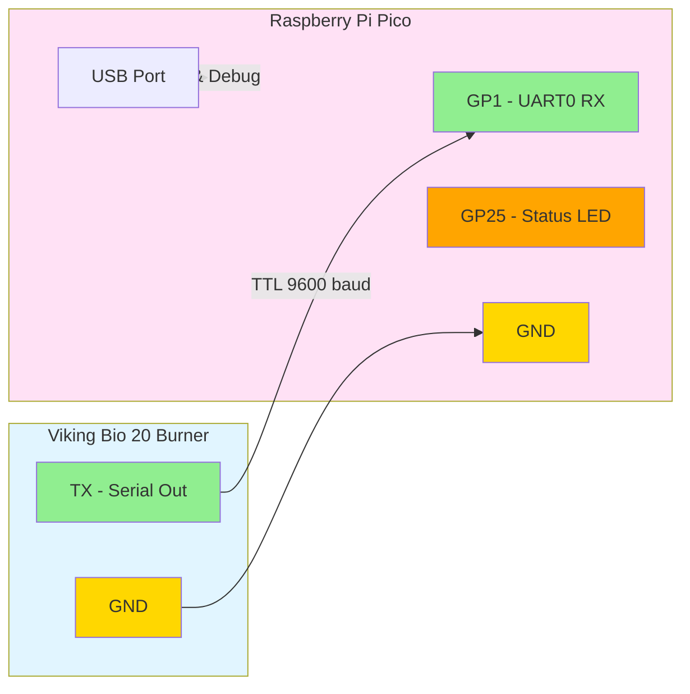

# Viking Bio Matter Bridge

A Matter (CHIP) bridge for the Viking Bio 20 burner, built for Raspberry Pi Pico. This firmware reads TTL serial data from the burner and exposes flame status and fan speed through the Matter protocol.

## Features

- **Serial Communication**: Reads TTL serial data at 9600 baud from Viking Bio 20 burner
- **Flame Detection**: Reports real-time flame status
- **Fan Speed Monitoring**: Reports current fan speed (0-100%)
- **Temperature Monitoring**: Reports burner temperature
- **Matter Bridge**: Exposes burner data through Matter protocol
- **Status LED**: Visual feedback of operation status

## Hardware Requirements

- Raspberry Pi Pico or Pico W
- Viking Bio 20 burner with TTL serial output
- USB cable for power and debugging

## Wiring

Connect the Viking Bio 20 TTL serial output to the Raspberry Pi Pico:



**Note**: The Pico RX pin (GP1) expects 3.3V logic levels. If the Viking Bio 20 outputs 5V TTL, use a level shifter or voltage divider.

## Serial Protocol

The firmware supports two serial data formats:

### Binary Protocol (Recommended)
```
[0xAA] [FLAGS] [FAN_SPEED] [TEMP_HIGH] [TEMP_LOW] [0x55]
```
- `FLAGS`: bit 0 = flame detected, bits 1-7 = error codes
- `FAN_SPEED`: 0-100 (percentage)
- `TEMP_HIGH, TEMP_LOW`: Temperature in Celsius (16-bit big-endian)

### Text Protocol (Fallback)
```
F:1,S:50,T:75\n
```
- `F`: Flame status (0=off, 1=on)
- `S`: Fan speed (0-100%)
- `T`: Temperature (°C)

## Building Firmware

### Prerequisites

1. Install the Pico SDK:
   ```bash
   git clone https://github.com/raspberrypi/pico-sdk.git
   cd pico-sdk
   git submodule update --init
   export PICO_SDK_PATH=$(pwd)
   ```

2. Install ARM toolchain:
   ```bash
   # Ubuntu/Debian
   sudo apt-get install cmake gcc-arm-none-eabi libnewlib-arm-none-eabi build-essential
   
   # macOS
   brew install cmake arm-none-eabi-gcc
   ```

### Build Steps

#### Standard Build (Matter Disabled)

```bash
mkdir build
cd build
cmake ..
make
```

This will generate `viking_bio_matter.uf2` in the build directory with basic functionality (serial parsing and stub Matter bridge).

#### Matter-Enabled Build (Pico W Only)

For full Matter protocol support on Raspberry Pi Pico W:

1. **Initialize the connectedhomeip submodule:**
   ```bash
   git submodule update --init --recursive third_party/connectedhomeip
   ```

2. **Configure WiFi credentials** in `platform/pico_w_chip_port/network_adapter.cpp`:
   ```cpp
   #define WIFI_SSID "YourNetworkName"
   #define WIFI_PASSWORD "YourPassword"
   ```

3. **Build with Matter enabled:**
   ```bash
   mkdir build
   cd build
   cmake -DENABLE_MATTER=ON ..
   make
   ```

This generates a Matter-enabled firmware that:
- Connects to WiFi on boot
- Initializes the Matter stack
- Prints commissioning QR code and PIN
- Exposes Viking Bio data as Matter attributes
- Can be commissioned by Matter controllers (e.g., chip-tool)

**Note:** Matter support requires Pico W for WiFi. Standard Pico is not supported for Matter builds.

See [platform/pico_w_chip_port/README.md](platform/pico_w_chip_port/README.md) for detailed Matter configuration and commissioning instructions.

### Flashing the Firmware

1. Hold the BOOTSEL button on the Pico while connecting it via USB
2. The Pico will appear as a mass storage device
3. Copy `build/viking_bio_matter.uf2` to the Pico
4. The Pico will automatically reboot with the new firmware

## GitHub Actions

The firmware is automatically built on push to `main` or `develop` branches. Build artifacts are available in the Actions tab.

## Usage

### Standard Mode (Matter Disabled)

1. Flash the firmware to your Raspberry Pi Pico
2. Connect the Viking Bio 20 serial output to the Pico (see Wiring section)
3. Power the Pico via USB
4. The onboard LED will blink to indicate activity
5. Connect to the Pico's USB serial port to see debug output:
   ```bash
   # Linux/macOS
   screen /dev/ttyACM0 115200
   
   # Windows (use PuTTY or similar)
   ```

### Matter Mode (Pico W with ENABLE_MATTER=ON)

1. Flash the Matter-enabled firmware to your Raspberry Pi Pico W
2. Connect the Viking Bio 20 serial output to the Pico (see Wiring section)
3. Power the Pico via USB
4. Connect to the Pico's USB serial to view commissioning info:
   ```bash
   screen /dev/ttyACM0 115200
   # Or use Thonny IDE (Tools > Serial)
   ```
   
   You'll see:
   ```
   ====================================
       Matter Commissioning Info
   ====================================
   Device MAC:     28:CD:C1:00:00:01
   Setup PIN Code: 24890840
   Discriminator:  3840 (0x0F00)
   
   ⚠️  IMPORTANT:
      PIN is derived from device MAC.
      Use tools/derive_pin.py to compute
      the PIN from the MAC address above.
   ====================================
   ```
   
   **Note**: The Setup PIN is unique per device, derived from its MAC address.
   You can compute it offline using:
   ```bash
   python3 tools/derive_pin.py 28:CD:C1:00:00:01
   ```

5. Commission the device using chip-tool with the **printed PIN**:
   ```bash
   # Use the PIN from your device's serial output
   chip-tool pairing ble-wifi 1 MySSID MyPassword 24890840 3840
   ```

6. Control and monitor attributes:
   ```bash
   # Read flame status (OnOff cluster)
   chip-tool onoff read on-off 1 1
   
   # Read fan speed (LevelControl cluster)
   chip-tool levelcontrol read current-level 1 1
   
   # Read temperature (TemperatureMeasurement cluster)
   chip-tool temperaturemeasurement read measured-value 1 1
   ```

For detailed Matter configuration and troubleshooting, see [platform/pico_w_chip_port/README.md](platform/pico_w_chip_port/README.md).
   # Read flame status (OnOff cluster)
   chip-tool onoff read on-off 1 1
   
   # Read fan speed (LevelControl cluster)
   chip-tool levelcontrol read current-level 1 1
   
   # Read temperature (TemperatureMeasurement cluster)
   chip-tool temperaturemeasurement read measured-value 1 1
   ```

**Matter Clusters Exposed:**
- **OnOff (0x0006)**: Flame detected state
- **LevelControl (0x0008)**: Fan speed (0-100%)
- **TemperatureMeasurement (0x0402)**: Burner temperature

⚠️ **Security Note:** 
- The Setup PIN is **unique per device**, derived from the device MAC address using SHA-256 with product salt `VIKINGBIO-2026`.
- The discriminator 3840 is for **testing only**. For production deployments, use unique discriminators per device (0-4095, excluding reserved ranges) and update `platform/pico_w_chip_port/CHIPDevicePlatformConfig.h`.
- The PIN derivation algorithm is documented in `tools/derive_pin.py` and can be computed offline from a printed MAC address.

For detailed Matter configuration and troubleshooting, see [platform/pico_w_chip_port/README.md](platform/pico_w_chip_port/README.md).

## Development

### Project Structure

```
viking-bio-matter/
├── src/
│   ├── main.c                 # Main application entry point
│   ├── serial_handler.c       # UART/serial communication
│   ├── viking_bio_protocol.c  # Viking Bio protocol parser
│   └── matter_bridge.c        # Matter bridge implementation (with/without Matter)
├── include/
│   ├── serial_handler.h
│   ├── viking_bio_protocol.h
│   └── matter_bridge.h
├── platform/
│   └── pico_w_chip_port/      # Matter platform port for Pico W
│       ├── network_adapter.cpp    # WiFi/lwIP integration
│       ├── storage_adapter.cpp    # Flash storage for fabrics
│       ├── crypto_adapter.cpp     # mbedTLS crypto
│       ├── platform_manager.cpp   # Platform coordination
│       └── README.md              # Detailed Matter documentation
├── third_party/
│   └── connectedhomeip/       # Matter SDK submodule (when initialized)
├── examples/
│   └── viking_bio_simulator.py # Serial data simulator for testing
├── CMakeLists.txt             # Build configuration with ENABLE_MATTER option
└── .github/
    └── workflows/
        └── build-firmware.yml # CI/CD pipeline
```

## License

This project is open source and available under the MIT License.

## Contributing

Contributions are welcome! Please feel free to submit a Pull Request.