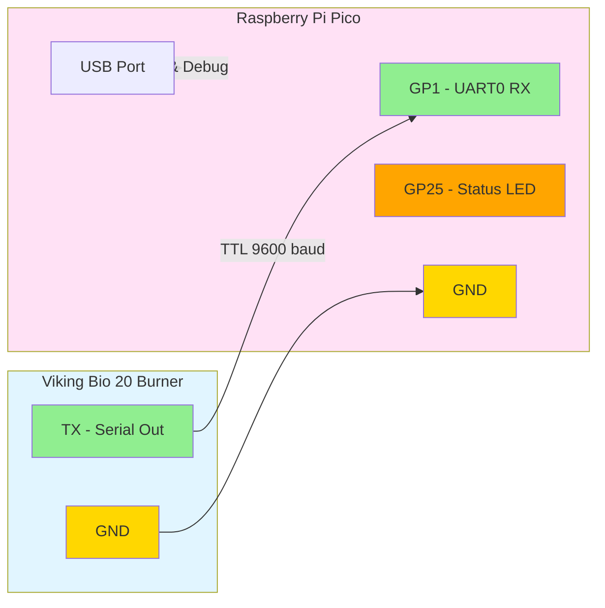

# Viking Bio Matter Bridge

A Matter (CHIP) bridge for the Viking Bio 20 burner. This project provides two implementations:

1. **Pico Firmware** (default): Runs on Raspberry Pi Pico/Pico W
2. **Host Bridge** (optional): Runs on Raspberry Pi Zero or any Linux system with full Matter support

Both implementations read TTL serial data from the Viking Bio 20 burner and expose flame status, fan speed, and temperature through the Matter protocol.

## Features

- **Serial Communication**: Reads TTL serial data at 9600 baud from Viking Bio 20 burner
- **Flame Detection**: Reports real-time flame status
- **Fan Speed Monitoring**: Reports current fan speed (0-100%)
- **Temperature Monitoring**: Reports burner temperature
- **Matter Bridge**: Exposes burner data through Matter protocol
- **Status LED**: Visual feedback of operation status

## Hardware Requirements

- Raspberry Pi Pico or Pico W
- Viking Bio 20 burner with TTL serial output
- USB cable for power and debugging

## Wiring

Connect the Viking Bio 20 TTL serial output to the Raspberry Pi Pico:



**Note**: The Pico RX pin (GP1) expects 3.3V logic levels. If the Viking Bio 20 outputs 5V TTL, use a level shifter or voltage divider.

## Serial Protocol

The firmware supports two serial data formats:

### Binary Protocol (Recommended)
```
[0xAA] [FLAGS] [FAN_SPEED] [TEMP_HIGH] [TEMP_LOW] [0x55]
```
- `FLAGS`: bit 0 = flame detected, bits 1-7 = error codes
- `FAN_SPEED`: 0-100 (percentage)
- `TEMP_HIGH, TEMP_LOW`: Temperature in Celsius (16-bit big-endian)

### Text Protocol (Fallback)
```
F:1,S:50,T:75\n
```
- `F`: Flame status (0=off, 1=on)
- `S`: Fan speed (0-100%)
- `T`: Temperature (°C)

## Quick Start

### Option 1: Raspberry Pi Pico (Default)

Build and flash firmware for Raspberry Pi Pico:

```bash
# Prerequisites: Install Pico SDK
export PICO_SDK_PATH=/path/to/pico-sdk

# Build
mkdir build && cd build
cmake ..
make

# Flash viking_bio_matter.uf2 to Pico
```

See detailed instructions below in [Building Pico Firmware](#building-pico-firmware).

### Option 2: Raspberry Pi Zero / Linux Host (Full Matter Support)

Run a full Matter bridge on Raspberry Pi Zero or any Linux system:

```bash
# Prerequisites: Install Matter SDK
export MATTER_ROOT=/path/to/connectedhomeip

# Build host bridge
mkdir build_host && cd build_host
cmake .. -DENABLE_MATTER=ON
make host_bridge

# Run bridge
./host_bridge --device /dev/ttyUSB0
```

See detailed instructions in [host_bridge/README.md](host_bridge/README.md).

## Host-Based Matter Bridge (Raspberry Pi Zero)

**New!** A complete Matter bridge implementation for Linux systems (Raspberry Pi Zero, Zero W, or any Linux host).

### Features

- ✅ **Full Matter 1.3 Support**: Complete connectedhomeip SDK integration
- ✅ **WiFi Commissioning**: QR code and setup code commissioning
- ✅ **Attribute Reporting**: Real-time updates to subscribed controllers
- ✅ **Three Matter Clusters**:
  - On/Off (0x0006) → Flame state
  - Level Control (0x0008) → Fan speed
  - Temperature Measurement (0x0402) → Temperature
- ✅ **POSIX Serial**: Reads from any serial device (USB or UART)
- ✅ **Systemd Integration**: Run as a system service
- ✅ **Opt-in**: Doesn't affect Pico firmware build

### Quick Start (Host Bridge)

```bash
# 1. Install Matter SDK (one-time setup)
git clone --branch v1.3-branch https://github.com/project-chip/connectedhomeip.git ~/connectedhomeip
cd ~/connectedhomeip
./scripts/checkout_submodules.py --shallow --platform linux
./scripts/build/build_examples.py --target linux-x64-all-clusters build
export MATTER_ROOT=~/connectedhomeip

# 2. Build host bridge
cd /path/to/viking-bio-matter
mkdir build_host && cd build_host
cmake .. -DENABLE_MATTER=ON
make host_bridge -j$(nproc)

# 3. Run bridge
./host_bridge --device /dev/ttyUSB0 --setup-code 20202021

# 4. Commission with Matter controller (scan QR code from output)
```

**Full documentation**: See [host_bridge/README.md](host_bridge/README.md) for complete setup, commissioning, and troubleshooting instructions.

### When to Use Which Implementation?

| Feature | Pico Firmware | Host Bridge (Linux) |
|---------|--------------|---------------------|
| **Hardware** | Raspberry Pi Pico | Raspberry Pi Zero / Linux |
| **Matter Support** | Planned/Stub | ✅ Full Matter 1.3 |
| **Commissioning** | Not yet | ✅ QR Code / Setup Code |
| **WiFi** | Pico W required | ✅ Built-in |
| **Resource Usage** | Low (embedded) | Higher (user-space) |
| **Setup Complexity** | Simple | Moderate (requires Matter SDK) |

## Building Pico Firmware

### Prerequisites

1. Install the Pico SDK:
   ```bash
   git clone https://github.com/raspberrypi/pico-sdk.git
   cd pico-sdk
   git submodule update --init
   export PICO_SDK_PATH=$(pwd)
   ```

2. Install ARM toolchain:
   ```bash
   # Ubuntu/Debian
   sudo apt-get install cmake gcc-arm-none-eabi libnewlib-arm-none-eabi build-essential
   
   # macOS
   brew install cmake arm-none-eabi-gcc
   ```

### Build Steps

```bash
mkdir build
cd build
cmake ..
make
```

This will generate `viking_bio_matter.uf2` in the build directory.

### Flashing the Firmware

1. Hold the BOOTSEL button on the Pico while connecting it via USB
2. The Pico will appear as a mass storage device
3. Copy `build/viking_bio_matter.uf2` to the Pico
4. The Pico will automatically reboot with the new firmware

## GitHub Actions

The firmware is automatically built on push to `main` or `develop` branches. Build artifacts are available in the Actions tab.

## Usage

1. Flash the firmware to your Raspberry Pi Pico
2. Connect the Viking Bio 20 serial output to the Pico (see Wiring section)
3. Power the Pico via USB
4. The onboard LED will blink to indicate activity
5. Connect to the Pico's USB serial port to see debug output:
   ```bash
   # Linux/macOS
   screen /dev/ttyACM0 115200
   
   # Windows (use PuTTY or similar)
   ```

## Development

### Project Structure

```
viking-bio-matter/
├── src/
│   ├── main.c                 # Main application entry point
│   ├── serial_handler.c       # UART/serial communication
│   ├── viking_bio_protocol.c  # Viking Bio protocol parser
│   └── matter_bridge.c        # Matter bridge implementation
├── include/
│   ├── serial_handler.h
│   ├── viking_bio_protocol.h
│   └── matter_bridge.h
├── CMakeLists.txt             # Build configuration
└── .github/
    └── workflows/
        └── build-firmware.yml # CI/CD pipeline
```

## License

This project is open source and available under the MIT License.

## Contributing

Contributions are welcome! Please feel free to submit a Pull Request.