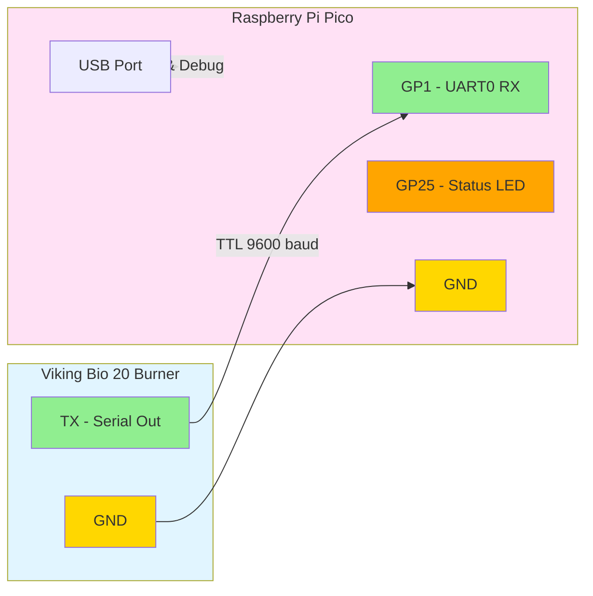

# Viking Bio Matter Bridge

A Matter (CHIP) bridge for the Viking Bio 20 burner with two implementations:
1. **Pico Firmware**: For Raspberry Pi Pico/Pico W (embedded)
2. **Host Bridge**: For Raspberry Pi Zero (Linux user-space with full Matter stack)

This project reads TTL serial data from the Viking Bio 20 burner and exposes flame status, fan speed, and temperature through the Matter protocol.

## Features

- **Serial Communication**: Reads TTL serial data at 9600 baud from Viking Bio 20 burner
- **Flame Detection**: Reports real-time flame status via Matter On/Off cluster
- **Fan Speed Monitoring**: Reports current fan speed (0-100%) via Matter Level Control cluster
- **Temperature Monitoring**: Reports burner temperature via Matter Temperature Measurement cluster
- **Matter Bridge**: Exposes burner data through Matter protocol for smart home integration
- **Status LED**: Visual feedback of operation status (Pico only)
- **Dual Implementation**: Choose between Pico firmware or Raspberry Pi host bridge

## Quick Start

### For Pico Firmware (Default)
See [Building Firmware](#building-firmware) section below.

### For Raspberry Pi Zero Host Bridge
See [Host-based Matter Bridge (Raspberry Pi Zero)](#host-based-matter-bridge-raspberry-pi-zero) section below or check the [host_bridge/README.md](host_bridge/README.md) for detailed instructions.

## Hardware Requirements

- Raspberry Pi Pico or Pico W
- Viking Bio 20 burner with TTL serial output
- USB cable for power and debugging

## Wiring

Connect the Viking Bio 20 TTL serial output to the Raspberry Pi Pico:



**Note**: The Pico RX pin (GP1) expects 3.3V logic levels. If the Viking Bio 20 outputs 5V TTL, use a level shifter or voltage divider.

## Serial Protocol

The firmware supports two serial data formats:

### Binary Protocol (Recommended)
```
[0xAA] [FLAGS] [FAN_SPEED] [TEMP_HIGH] [TEMP_LOW] [0x55]
```
- `FLAGS`: bit 0 = flame detected, bits 1-7 = error codes
- `FAN_SPEED`: 0-100 (percentage)
- `TEMP_HIGH, TEMP_LOW`: Temperature in Celsius (16-bit big-endian)

### Text Protocol (Fallback)
```
F:1,S:50,T:75\n
```
- `F`: Flame status (0=off, 1=on)
- `S`: Fan speed (0-100%)
- `T`: Temperature (°C)

## Building Firmware

### Prerequisites

1. Install the Pico SDK:
   ```bash
   git clone https://github.com/raspberrypi/pico-sdk.git
   cd pico-sdk
   git submodule update --init
   export PICO_SDK_PATH=$(pwd)
   ```

2. Install ARM toolchain:
   ```bash
   # Ubuntu/Debian
   sudo apt-get install cmake gcc-arm-none-eabi libnewlib-arm-none-eabi build-essential
   
   # macOS
   brew install cmake arm-none-eabi-gcc
   ```

### Build Steps

```bash
mkdir build
cd build
cmake ..
make
```

This will generate `viking_bio_matter.uf2` in the build directory.

### Flashing the Firmware

1. Hold the BOOTSEL button on the Pico while connecting it via USB
2. The Pico will appear as a mass storage device
3. Copy `build/viking_bio_matter.uf2` to the Pico
4. The Pico will automatically reboot with the new firmware

## GitHub Actions

The firmware is automatically built on push to `main` or `develop` branches. Build artifacts are available in the Actions tab.

## Usage

1. Flash the firmware to your Raspberry Pi Pico
2. Connect the Viking Bio 20 serial output to the Pico (see Wiring section)
3. Power the Pico via USB
4. The onboard LED will blink to indicate activity
5. Connect to the Pico's USB serial port to see debug output:
   ```bash
   # Linux/macOS
   screen /dev/ttyACM0 115200
   
   # Windows (use PuTTY or similar)
   ```

## Host-based Matter Bridge (Raspberry Pi Zero)

For a full Matter implementation running on Raspberry Pi Zero (or any Raspberry Pi/Linux system), use the host bridge instead of the Pico firmware.

### Why Use the Host Bridge?

The host bridge provides:
- **Full Matter SDK Integration**: Uses the complete Project CHIP/connectedhomeip SDK
- **WiFi Commissioning**: Standard Matter commissioning with QR codes
- **Better Performance**: More processing power for complex Matter operations
- **Easy Updates**: Update software without flashing firmware
- **Production Ready**: Complete Matter stack with proper attribute reporting

### Quick Setup

1. **Hardware**: Raspberry Pi Zero W/2W with USB-to-serial adapter connected to Viking Bio 20
2. **Software**: Install dependencies and build Matter SDK (see [host_bridge/README.md](host_bridge/README.md))
3. **Build**: 
   ```bash
   export MATTER_ROOT=/path/to/connectedhomeip
   mkdir build_host && cd build_host
   cmake .. -DENABLE_MATTER=ON
   make
   ```
4. **Run**:
   ```bash
   ./host_bridge/host_bridge --device /dev/ttyUSB0 --setup-code 20202021
   ```

### Commissioning

Commission with any Matter controller (Google Home, Apple Home, chip-tool, etc.) using setup code `20202021`.

For detailed instructions, see **[host_bridge/README.md](host_bridge/README.md)**.

## Development

### Project Structure

```
viking-bio-matter/
├── src/                       # Pico firmware source
│   ├── main.c                 # Main application entry point
│   ├── serial_handler.c       # UART/serial communication
│   ├── viking_bio_protocol.c  # Viking Bio protocol parser
│   └── matter_bridge.c        # Matter bridge stub (Pico)
├── include/
│   ├── serial_handler.h
│   ├── viking_bio_protocol.h
│   └── matter_bridge.h
├── host_bridge/               # Raspberry Pi host bridge
│   ├── main.cpp               # Host bridge entry point
│   ├── matter_bridge.cpp      # Full Matter SDK integration
│   ├── viking_bio_protocol_linux.c  # Protocol parser (Linux)
│   ├── CMakeLists.txt         # Host bridge build config
│   ├── README.md              # Host bridge documentation
│   └── host_bridge.service   # Systemd service file
├── examples/
│   ├── viking_bio_simulator.py    # Serial data simulator
│   └── run_host_bridge.sh         # Host bridge run script
├── CMakeLists.txt             # Build configuration
└── .github/
    └── workflows/
        └── build-firmware.yml # CI/CD pipeline
```

## License

This project is open source and available under the MIT License.

## Contributing

Contributions are welcome! Please feel free to submit a Pull Request.