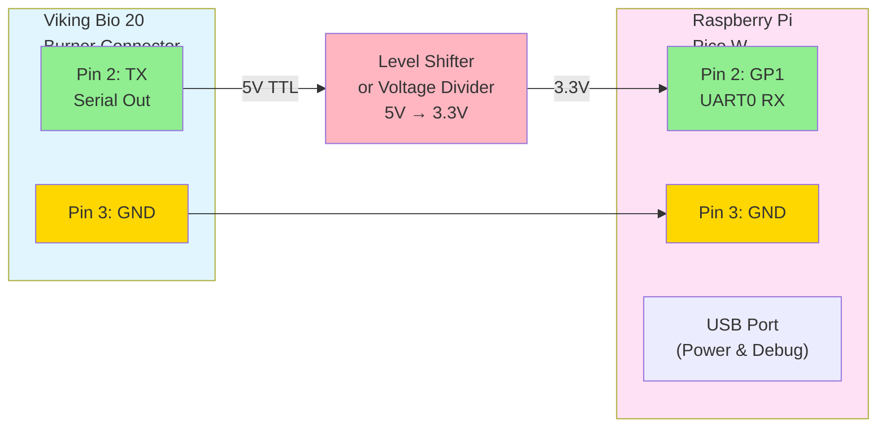

# Viking Bio Matter Bridge

A Matter (CHIP) bridge for the Viking Bio 20 burner, built for Raspberry Pi Pico W. This firmware reads TTL serial data from the burner and exposes flame status and fan speed through the Matter protocol.

## Features

- **Serial Communication**: Reads TTL serial data at 9600 baud from Viking Bio 20 burner
- **Flame Detection**: Reports real-time flame status
- **Fan Speed Monitoring**: Reports current fan speed (0-100%)
- **Temperature Monitoring**: Reports burner temperature
- **Matter Bridge**: Exposes burner data through Matter protocol over WiFi
- **WiFi Connectivity**: Connects to your local network for Matter communication

## Hardware Requirements

- **Raspberry Pi Pico W** (WiFi required for Matter)
- Viking Bio 20 burner with TTL serial output
- USB cable for power and debugging

## Wiring

Connect the Viking Bio 20 TTL serial output to the Raspberry Pi Pico W:


**Note**: The Pico W RX pin (GP1) expects 3.3V logic levels. The Viking Bio 20's TTL output voltage should be verified before connecting directly. If it outputs 5V TTL (which is common), a level shifter (e.g., bi-directional logic level converter) or voltage divider (two resistors: 2kΩ from TX to RX, 1kΩ from RX to GND) is required for safe voltage conversion. The diagram above shows the configuration with level shifting, which is the recommended safe approach.

## Serial Protocol

The firmware supports two serial data formats:

### Binary Protocol (Recommended)
```
[0xAA] [FLAGS] [FAN_SPEED] [TEMP_HIGH] [TEMP_LOW] [0x55]
```
- `FLAGS`: bit 0 = flame detected, bits 1-7 = error codes
- `FAN_SPEED`: 0-100 (percentage)
- `TEMP_HIGH, TEMP_LOW`: Temperature in Celsius (16-bit big-endian)

### Text Protocol (Fallback)
```
F:1,S:50,T:75\n
```
- `F`: Flame status (0=off, 1=on)
- `S`: Fan speed (0-100%)
- `T`: Temperature (°C)

## Building Firmware

### Prerequisites

1. Install the Pico SDK:
   ```bash
   git clone https://github.com/raspberrypi/pico-sdk.git
   cd pico-sdk
   git submodule update --init
   export PICO_SDK_PATH=$(pwd)
   ```

2. Install ARM toolchain:
   ```bash
   # Ubuntu/Debian
   sudo apt-get install cmake gcc-arm-none-eabi libnewlib-arm-none-eabi build-essential
   
   # macOS
   brew install cmake arm-none-eabi-gcc
   ```

### Build Steps

1. **Build the firmware:**
   ```bash
   mkdir build
   cd build
   cmake ..
   make
   ```

This generates Matter-enabled firmware that:
- **Automatically checks for stored WiFi credentials on boot**
- **Falls back to SoftAP mode if no credentials are found**
- **Connects to WiFi using stored credentials if available**
- Initializes the Matter stack
- Prints commissioning QR code and PIN
- Exposes Viking Bio data as Matter attributes
- Can be commissioned by Matter controllers (e.g., chip-tool)

See [platform/pico_w_chip_port/README.md](platform/pico_w_chip_port/README.md) for detailed Matter configuration and commissioning instructions.

### WiFi Commissioning Flow

The device supports two WiFi commissioning modes:

#### Mode 1: SoftAP Commissioning (Default)
When the device boots without stored WiFi credentials, it automatically starts in SoftAP mode:

1. **Device boots in SoftAP mode**
   - SSID: `VikingBio-Setup`
   - Password: `vikingbio2026`
   - Device IP: `192.168.4.1`

2. **Connect to the SoftAP**
   ```bash
   # On your commissioning device (laptop/phone):
   # - Connect to WiFi: VikingBio-Setup
   # - Password: vikingbio2026
   # - Configure static IP: 192.168.4.2, Netmask: 255.255.255.0
   ```

3. **Commission via Matter**
   ```bash
   # Use chip-tool or other Matter controller
   # The controller will send WiFi credentials via Matter commands
   chip-tool networkcommissioning add-or-update-wifi-network hex:YOUR_SSID hex:YOUR_PASSWORD 1 0
   chip-tool networkcommissioning connect-network hex:YOUR_SSID 1 0
   ```

4. **Device automatically connects to WiFi**
   - Credentials are saved to flash
   - Device stops SoftAP mode
   - Device connects to your WiFi network
   - Continues Matter commissioning on the WiFi network

#### Mode 2: Pre-Configured WiFi (Optional)
If you want to pre-configure WiFi credentials via flash storage:

1. Use the storage API to save credentials during build/flash
2. Device will automatically connect on boot
3. No SoftAP mode needed

### Building with Pre-configured WiFi (Legacy)

**Note**: This method is deprecated. Use SoftAP commissioning instead.

If you absolutely need to hardcode WiFi credentials for testing:

1. **Configure WiFi credentials** by calling the storage API programmatically:
   ```c
   storage_adapter_save_wifi_credentials("YourSSID", "YourPassword");
   ```

2. **Build the firmware** as shown above.

### Flashing the Firmware

1. Hold the BOOTSEL button on the Pico W while connecting it via USB
2. The Pico W will appear as a mass storage device
3. Copy `build/viking_bio_matter.uf2` to the Pico W
4. The Pico W will automatically reboot with the new firmware

## GitHub Actions

The firmware is automatically built on push to `main` or `develop` branches. Build artifacts are available in the Actions tab.

## Usage

1. Flash the firmware to your Raspberry Pi Pico W
2. Connect the Viking Bio 20 serial output to the Pico W (see Wiring section)
3. Power the Pico W via USB
4. Connect to the Pico's USB serial to view commissioning info:
   ```bash
   screen /dev/ttyACM0 115200
   # Or use Thonny IDE (Tools > Serial)
   ```
   
   You'll see:
   ```
   ====================================
       Matter Commissioning Info
   ====================================
   Device MAC:     28:CD:C1:00:00:01
   Setup PIN Code: 24890840
   Discriminator:  3840 (0x0F00)
   
   ⚠️  IMPORTANT:
      PIN is derived from device MAC.
      Use tools/derive_pin.py to compute
      the PIN from the MAC address above.
   ====================================
   ```
   
   **Note**: The Setup PIN is unique per device, derived from its MAC address.
   You can compute it offline using:
   ```bash
   python3 tools/derive_pin.py 28:CD:C1:00:00:01
   ```

5. **Commission the device using Matter controller:**
   
   **Option A: Via SoftAP (Recommended - No credentials needed)**
   ```bash
   # Step 1: Connect your computer to the SoftAP
   # WiFi SSID: VikingBio-Setup
   # Password: vikingbio2026
   # Static IP: 192.168.4.2 (device is at 192.168.4.1)
   
   # Step 2: Convert your WiFi credentials to hex
   echo -n "MySSID" | xxd -p    # Example output: 4d79535349441234
   echo -n "MyPassword" | xxd -p # Example output: 4d7950617373776f7264
   
   # Step 3: Provision WiFi credentials via Matter
   chip-tool networkcommissioning add-or-update-wifi-network hex:YOUR_SSID_HEX hex:YOUR_PASSWORD_HEX 1 0
   
   # Step 4: Connect to the WiFi network
   chip-tool networkcommissioning connect-network hex:YOUR_SSID_HEX 1 0
   
   # Step 5: Complete Matter commissioning (device now on your WiFi)
   chip-tool pairing onnetwork 1 24890840
   ```
   
   **Option B: Direct WiFi (If credentials pre-stored)**
   ```bash
   # Use the printed PIN from device's serial output
   chip-tool pairing ble-wifi 1 MySSID MyPassword 24890840 3840
   ```

6. Control and monitor attributes:
   ```bash
   # Read flame status (OnOff cluster)
   chip-tool onoff read on-off 1 1
   
   # Read fan speed (LevelControl cluster)
   chip-tool levelcontrol read current-level 1 1
   
   # Read temperature (TemperatureMeasurement cluster)
   chip-tool temperaturemeasurement read measured-value 1 1
   ```

**Matter Clusters Exposed:**
- **OnOff (0x0006)**: Flame detected state
- **LevelControl (0x0008)**: Fan speed (0-100%)
- **TemperatureMeasurement (0x0402)**: Burner temperature
- **NetworkCommissioning (0x0031)**: WiFi network provisioning

**NetworkCommissioning Commands:**
```bash
# Add or update WiFi credentials
chip-tool networkcommissioning add-or-update-wifi-network hex:SSID_HEX hex:PASSWORD_HEX 1 0

# Connect to WiFi network
chip-tool networkcommissioning connect-network hex:SSID_HEX 1 0

# Read network status
chip-tool networkcommissioning read last-networking-status 1 0
chip-tool networkcommissioning read last-network-id 1 0
```

⚠️ **Security Note:** 
- The Setup PIN is **unique per device**, derived from the device MAC address using SHA-256 with product salt `VIKINGBIO-2026`.
- The discriminator 3840 is for **testing only**. For production deployments, use unique discriminators per device (0-4095, excluding reserved ranges) and update `platform/pico_w_chip_port/CHIPDevicePlatformConfig.h`.
- The PIN derivation algorithm is documented in `tools/derive_pin.py` and can be computed offline from a printed MAC address.

For detailed Matter configuration and troubleshooting, see [platform/pico_w_chip_port/README.md](platform/pico_w_chip_port/README.md).

## Troubleshooting

### WiFi Commissioning Issues

**Problem: Device stuck in SoftAP mode**
- **Cause**: WiFi credentials not saved or connection failed
- **Solution**:
  1. Verify credentials are correct (case-sensitive)
  2. Check WiFi signal strength
  3. Try clearing stored credentials: Power cycle device, it will restart in SoftAP mode
  4. Check serial output for error messages

**Problem: Cannot connect to SoftAP**
- **Cause**: Static IP not configured correctly
- **Solution**:
  1. Manually configure network:
     - IP: 192.168.4.2
     - Netmask: 255.255.255.0
     - Gateway: 192.168.4.1
  2. Verify WiFi password: `vikingbio2026`
  3. Check that device is actually in SoftAP mode (check serial output)

**Problem: Matter commands fail over SoftAP**
- **Cause**: Network connectivity or Matter protocol issues
- **Solution**:
  1. Verify you can ping 192.168.4.1 from your commissioning device
  2. Ensure chip-tool is configured for IPv4
  3. Check firewall settings
  4. Try using the full hex format for SSID/password

**Problem: Device doesn't connect after provisioning**
- **Cause**: Credentials saved but connection failed
- **Solution**:
  1. Check serial output for connection error codes
  2. Verify WiFi network is 2.4GHz (Pico W doesn't support 5GHz)
  3. Ensure WiFi uses WPA2-PSK authentication
  4. Try manually connecting: Use Option B with hardcoded credentials for testing

**Problem: Lost WiFi credentials, need to re-provision**
- **Solution**:
  1. Clear flash storage by re-flashing firmware
  2. Or: Power cycle - device will auto-start SoftAP if credentials fail
  3. Serial command (if implemented): Send reset command via USB serial

### Converting SSID/Password to Hex

```bash
# Using xxd (Linux/Mac)
echo -n "MyWiFiNetwork" | xxd -p

# Using Python
python3 -c "import sys; print(sys.argv[1].encode('utf-8').hex())" "MyWiFiNetwork"

# Using online tools
# Search for "text to hex converter"
```

### Checking Device Status

```bash
# Connect to serial monitor
screen /dev/ttyACM0 115200

# Look for these status messages:
# - "WiFi credentials found in flash" - Has stored credentials
# - "Starting SoftAP mode" - In provisioning mode
# - "WiFi connected successfully" - Connected to network
# - "IP Address: x.x.x.x" - Device network address
```

### Matter Commissioning Debug

```bash
# Enable verbose logging in chip-tool
chip-tool --trace_decode 1 networkcommissioning add-or-update-wifi-network ...

# Check if device is discoverable
dns-sd -B _matterc._udp

# Verify device is commissioned
chip-tool pairing code 1 <setup-code>
```

## Development

### Project Structure

```
viking-bio-matter/
├── src/
│   ├── main.c                 # Main application entry point
│   ├── serial_handler.c       # UART/serial communication
│   ├── viking_bio_protocol.c  # Viking Bio protocol parser
│   └── matter_bridge.c        # Matter bridge implementation
├── include/
│   ├── serial_handler.h
│   ├── viking_bio_protocol.h
│   └── matter_bridge.h
├── platform/
│   └── pico_w_chip_port/      # Matter platform port for Pico W
│       ├── network_adapter.cpp    # WiFi/lwIP integration
│       ├── storage_adapter.cpp    # Flash storage for fabrics
│       ├── crypto_adapter.cpp     # mbedTLS crypto
│       ├── platform_manager.cpp   # Platform coordination
│       └── README.md              # Detailed Matter documentation
├── src/
│   ├── matter_minimal/          # Minimal Matter protocol implementation
│   │   ├── codec/               # TLV and message encoding
│   │   ├── transport/           # UDP transport layer
│   │   ├── security/            # PASE and session management
│   │   ├── interaction/         # Interaction model (read/subscribe)
│   │   └── clusters/            # Standard Matter clusters
│   ├── main.c                   # Entry point
│   ├── serial_handler.c         # UART RX handler
│   ├── matter_bridge.cpp        # Matter integration
│   └── viking_bio_protocol.c    # Protocol parser
├── examples/
│   └── viking_bio_simulator.py # Serial data simulator for testing
├── CMakeLists.txt             # Build configuration
└── .github/
    └── workflows/
        └── build-firmware.yml # CI/CD pipeline
```

### Storage Implementation with LittleFS

The firmware uses **LittleFS** for persistent storage, providing:

- **Wear Leveling**: Automatically distributes writes across flash memory to extend lifespan
- **Power-Loss Resilience**: Atomic operations recoverable from unexpected power loss
- **Efficient**: Dynamic block allocation with minimal overhead
- **Thread-Safe**: Protected by mutexes when compiled with `LFS_THREADSAFE=1`

**Configuration:**
- **Location**: Last 256KB of the 2MB flash
- **Filesystem**: LittleFS via [pico-lfs](https://github.com/tjko/pico-lfs)
- **Storage**: WiFi credentials, Matter fabric data, ACLs

**Testing:**
See `tests/storage/README.md` for test procedures including basic read/write, overwrite/delete, power cycle persistence, and wear leveling stress tests.

## Testing

### Serial Simulator

For testing without hardware, use the included simulator:

```bash
# Install dependencies
pip3 install pyserial

# Run simulator with binary protocol (default)
python3 examples/viking_bio_simulator.py /dev/ttyUSB0

# Run simulator with text protocol
python3 examples/viking_bio_simulator.py -p text /dev/ttyUSB0

# Change update interval
python3 examples/viking_bio_simulator.py -i 2.0 /dev/ttyUSB0
```

### Manual Testing

Send test data directly:

```bash
# Binary protocol (hex)
echo -ne '\xAA\x01\x50\x00\x4B\x55' > /dev/ttyUSB0

# Text protocol
echo "F:1,S:80,T:75" > /dev/ttyUSB0
```

### Debug Output

Connect to the Pico's USB serial port:

```bash
screen /dev/ttyACM0 115200
```

Expected output:
```
Viking Bio Matter Bridge starting...
Setting up WiFi...
Connecting to WiFi: YourNetworkName
WiFi connected, IP: 192.168.1.xxx
====================================
   Matter Commissioning Info
====================================
Device MAC:     28:CD:C1:00:00:01
Setup PIN Code: 24890840  (derived from MAC)
Discriminator:  3840 (0x0F00)
====================================
Flame: ON, Fan Speed: 80%, Temp: 75°C
Matter: OnOff cluster updated - Flame ON
Matter: LevelControl cluster updated - Fan speed 80%
```

### Testing Matter Integration

1. **Build and flash firmware:**
   ```bash
   cd build
   cmake .. && make
   # Flash viking_bio_matter.uf2 to Pico W
   ```

2. **Monitor commissioning info:**
   ```bash
   screen /dev/ttyACM0 115200
   ```
   
   Look for the commissioning information displayed on boot.

3. **Commission with a Matter controller:**
   
   The device can be commissioned using any Matter-compatible controller. For testing with chip-tool:
   
   ```bash
   # Commission device using the PIN from your device's serial output
   chip-tool pairing code 1 <PIN>
   ```

4. **Test attribute reads:**
   ```bash
   # Flame status
   ./out/host/chip-tool onoff read on-off 1 1
   
   # Fan speed
   ./out/host/chip-tool levelcontrol read current-level 1 1
   
   # Temperature
   ./out/host/chip-tool temperaturemeasurement read measured-value 1 1
   ```

5. **Test attribute updates with simulator:**
   ```bash
   # In one terminal, run simulator
   python3 examples/viking_bio_simulator.py /dev/ttyUSB0
   
   # In another, watch attributes change
   watch -n 2 './out/host/chip-tool onoff read on-off 1 1'
   ```

## Known Limitations

1. **No OTA support**: Firmware updates require physical USB access (hold BOOTSEL button and copy .uf2 file)
2. **WiFi only**: No Thread or Ethernet support currently
3. **Storage with wear leveling**: LittleFS-based key-value store with automatic wear leveling for extended flash lifespan
4. **Limited fabrics**: Maximum 5 Matter fabrics due to memory constraints (264KB RAM on RP2040)
5. **Crypto limitations**: DRBG and RNG functions are stubbed due to Pico SDK 1.5.1 mbedTLS bugs (SHA256 and AES work correctly)

## Security Considerations

⚠️ **CRITICAL**: Default commissioning credentials are for TESTING ONLY

**Production deployment requires:**
1. Unique per-device discriminator (0-4095, excluding reserved ranges)
2. Device-specific setup PIN codes (each device has unique PIN derived from MAC)
3. Update `platform/pico_w_chip_port/CHIPDevicePlatformConfig.h`:
   - Discriminator 3840 is reserved for testing per Matter Core Specification 5.1.3.1
   - Production devices MUST use unique discriminators

**WiFi Security:**
- WiFi credentials are hardcoded in `platform/pico_w_chip_port/network_adapter.cpp`
- Never commit credentials to version control
- Consider using a secure provisioning method for production

## Future Enhancements

1. **Enhanced Matter Integration**
   - ✅ Commissioning flow
   - ✅ Attribute subscriptions
   - ✅ WiFi support (Pico W)
   - ⏳ Command handling for bidirectional control
   - ⏳ OTA firmware updates

2. **Network Connectivity**
   - ✅ WiFi support (Pico W)
   - ⏳ Thread support (with external radio)
   - ⏳ Ethernet support (with W5500 module)

3. **Advanced Features**
   - ⏳ OTA firmware updates over Matter
   - ⏳ Enhanced error reporting via Matter events
   - ⏳ Historical data logging
   - ⏳ Alarm notifications

4. **Protocol Extensions**
   - ⏳ Support for multiple Viking Bio devices
   - ⏳ Bidirectional communication (control burner)
   - ⏳ Enhanced diagnostics

5. **Production Readiness**
   - ⏳ Per-device unique commissioning credentials
   - ⏳ Secure boot and attestation
   - ✅ Flash wear leveling for storage (LittleFS)
   - ⏳ Watchdog and fault recovery

## References

- [Matter Specification](https://csa-iot.org/all-solutions/matter/)
- [Raspberry Pi Pico SDK](https://github.com/raspberrypi/pico-sdk)
- [Viking Bio 20 Documentation](https://www.vikingbio.se/)
- [Platform Port README](platform/pico_w_chip_port/README.md) - Detailed Matter configuration

## License

This project is licensed under the Creative Commons Attribution-NonCommercial-ShareAlike 4.0 International License (CC BY-NC-SA 4.0). This means you can use, modify, and share this project for non-commercial purposes, as long as you provide attribution and share derivatives under the same license.

See the [LICENSE](LICENSE) file for details or visit https://creativecommons.org/licenses/by-nc-sa/4.0/

## Contributing

Contributions are welcome! Please feel free to submit a Pull Request.