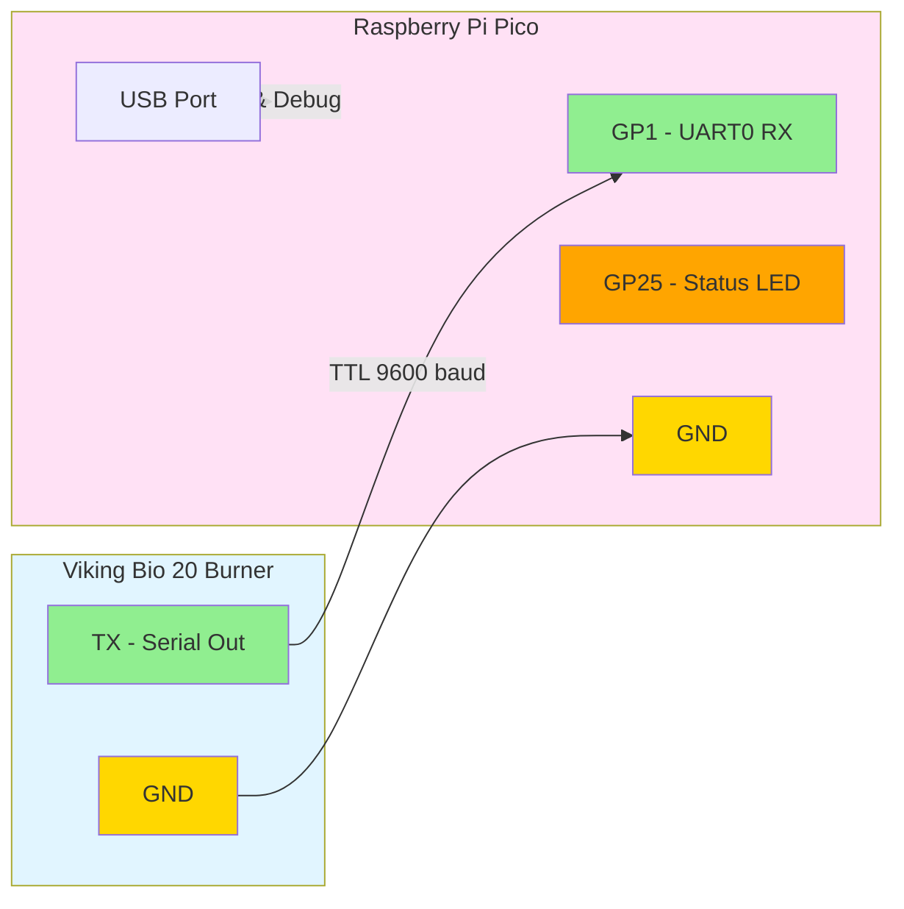

# Viking Bio Matter Bridge

A Matter (CHIP) bridge for the Viking Bio 20 burner. This project provides two implementations:

1. **Raspberry Pi Pico firmware** - Embedded Matter bridge running on Pico microcontroller
2. **Raspberry Pi Zero host bridge** - Linux userspace Matter bridge with full Matter SDK support ⭐ **NEW**

Both implementations read TTL serial data from the burner and expose flame status, fan speed, and temperature through the Matter protocol.

## Choose Your Implementation

### Option 1: Raspberry Pi Pico (Embedded)
- Runs directly on Pico/Pico W microcontroller
- Lower power consumption
- Currently has basic Matter stubs (full SDK integration planned)
- See [Building Pico Firmware](#building-pico-firmware) section below

### Option 2: Raspberry Pi Zero (Host Bridge) ⭐ Recommended
- Full Matter stack with complete cluster support
- WiFi commissioning and control
- Easy to update and debug
- See [Host-based Matter Bridge](#host-based-matter-bridge-raspberry-pi-zero) section below

## Features

- **Serial Communication**: Reads TTL serial data at 9600 baud from Viking Bio 20 burner
- **Flame Detection**: Reports real-time flame status
- **Fan Speed Monitoring**: Reports current fan speed (0-100%)
- **Temperature Monitoring**: Reports burner temperature
- **Matter Bridge**: Exposes burner data through Matter protocol
- **Status LED**: Visual feedback of operation status

## Hardware Requirements

- Raspberry Pi Pico or Pico W
- Viking Bio 20 burner with TTL serial output
- USB cable for power and debugging

## Wiring

Connect the Viking Bio 20 TTL serial output to the Raspberry Pi Pico:



**Note**: The Pico RX pin (GP1) expects 3.3V logic levels. If the Viking Bio 20 outputs 5V TTL, use a level shifter or voltage divider.

## Serial Protocol

The firmware supports two serial data formats:

### Binary Protocol (Recommended)
```
[0xAA] [FLAGS] [FAN_SPEED] [TEMP_HIGH] [TEMP_LOW] [0x55]
```
- `FLAGS`: bit 0 = flame detected, bits 1-7 = error codes
- `FAN_SPEED`: 0-100 (percentage)
- `TEMP_HIGH, TEMP_LOW`: Temperature in Celsius (16-bit big-endian)

### Text Protocol (Fallback)
```
F:1,S:50,T:75\n
```
- `F`: Flame status (0=off, 1=on)
- `S`: Fan speed (0-100%)
- `T`: Temperature (°C)

## Building Pico Firmware

This section covers building the embedded firmware for Raspberry Pi Pico. For the host bridge, see the next section.

### Prerequisites

1. Install the Pico SDK:
   ```bash
   git clone https://github.com/raspberrypi/pico-sdk.git
   cd pico-sdk
   git submodule update --init
   export PICO_SDK_PATH=$(pwd)
   ```

2. Install ARM toolchain:
   ```bash
   # Ubuntu/Debian
   sudo apt-get install cmake gcc-arm-none-eabi libnewlib-arm-none-eabi build-essential
   
   # macOS
   brew install cmake arm-none-eabi-gcc
   ```

### Build Steps

```bash
mkdir build
cd build
cmake ..
make
```

This will generate `viking_bio_matter.uf2` in the build directory.

### Flashing the Firmware

1. Hold the BOOTSEL button on the Pico while connecting it via USB
2. The Pico will appear as a mass storage device
3. Copy `build/viking_bio_matter.uf2` to the Pico
4. The Pico will automatically reboot with the new firmware

## GitHub Actions

The Pico firmware is automatically built on push to `main` or `develop` branches. Build artifacts are available in the Actions tab. The host bridge is not built in CI by default (Matter SDK is large).

---

## Host-based Matter Bridge (Raspberry Pi Zero)

The host bridge is a Linux userspace application that provides full Matter protocol support for the Viking Bio 20 burner.

### Features

- **Full Matter Stack**: Complete implementation using Project CHIP (connectedhomeip) SDK
- **WiFi Commissioning**: Supports QR code and setup code commissioning
- **Three Matter Clusters**:
  - On/Off (0x0006) - Flame detection state
  - Level Control (0x0008) - Fan speed (0-100%)
  - Temperature Measurement (0x0402) - Burner temperature
- **Attribute Reporting**: Real-time updates when values change
- **Flexible Configuration**: Command-line options for serial device, baud rate, and setup code
- **Systemd Integration**: Run as a system service with automatic startup

### Quick Start

1. **Install dependencies** on Raspberry Pi Zero:
   ```bash
   sudo apt-get update
   sudo apt-get install -y build-essential cmake git pkg-config \
       libssl-dev libglib2.0-dev libavahi-client-dev libdbus-1-dev
   ```

2. **Get the Matter SDK** (one-time setup):
   ```bash
   cd ~
   git clone --depth 1 --branch v1.2-branch \
       https://github.com/project-chip/connectedhomeip.git
   cd connectedhomeip
   ./scripts/checkout_submodules.py --shallow --platform linux
   source scripts/activate.sh
   
   # Build (this takes time on Pi Zero, consider cross-compiling)
   ./scripts/build/build_examples.py --target linux-arm-chip-tool build
   
   export MATTER_ROOT=$(pwd)
   ```

3. **Build the host bridge**:
   ```bash
   cd ~/viking-bio-matter
   mkdir -p build_host && cd build_host
   cmake .. -DENABLE_MATTER=ON
   make host_bridge
   ```

4. **Run the bridge**:
   ```bash
   # Using the helper script
   cd ~/viking-bio-matter
   ./examples/run_bridge.sh
   
   # Or run directly
   ./build_host/host_bridge/host_bridge --device /dev/ttyUSB0
   ```

5. **Commission the device** using chip-tool, Apple Home, Google Home, or Amazon Alexa:
   - Default setup code: `20202021`
   - Scan QR code or enter setup code in your Matter controller app

### Detailed Documentation

For complete build instructions, configuration options, commissioning steps, and troubleshooting, see:

📖 **[host_bridge/README.md](host_bridge/README.md)**

This includes:
- Detailed Matter SDK setup and build instructions
- Serial device configuration (USB, GPIO UART)
- Systemd service setup
- Commissioning with various controllers
- Troubleshooting common issues
- Development and testing tips

---

## Pico Firmware Usage

This section covers using the embedded Pico firmware.

1. Flash the firmware to your Raspberry Pi Pico
2. Connect the Viking Bio 20 serial output to the Pico (see Wiring section)
3. Power the Pico via USB
4. The onboard LED will blink to indicate activity
5. Connect to the Pico's USB serial port to see debug output:
   ```bash
   # Linux/macOS
   screen /dev/ttyACM0 115200
   
   # Windows (use PuTTY or similar)
   ```

## Development

### Project Structure

```
viking-bio-matter/
├── src/                       # Raspberry Pi Pico firmware
│   ├── main.c                 # Main application entry point
│   ├── serial_handler.c       # UART/serial communication
│   ├── viking_bio_protocol.c  # Viking Bio protocol parser
│   └── matter_bridge.c        # Matter bridge stubs
├── include/                   # Pico firmware headers
│   ├── serial_handler.h
│   ├── viking_bio_protocol.h
│   └── matter_bridge.h
├── host_bridge/              # Raspberry Pi Zero host bridge ⭐ NEW
│   ├── main.cpp              # Host bridge application
│   ├── matter_bridge.cpp     # Full Matter SDK integration
│   ├── viking_bio_protocol_linux.c  # Protocol parser (Linux)
│   ├── CMakeLists.txt        # Host bridge build config
│   ├── README.md             # Detailed documentation
│   └── host_bridge.service   # Systemd service template
├── examples/
│   ├── run_bridge.sh         # Helper script to run host bridge
│   └── viking_bio_simulator.py  # Serial data simulator
├── CMakeLists.txt            # Top-level build configuration
└── .github/
    └── workflows/
        └── build-firmware.yml  # CI/CD pipeline
```

## License

This project is open source and available under the MIT License.

## Contributing

Contributions are welcome! Please feel free to submit a Pull Request.